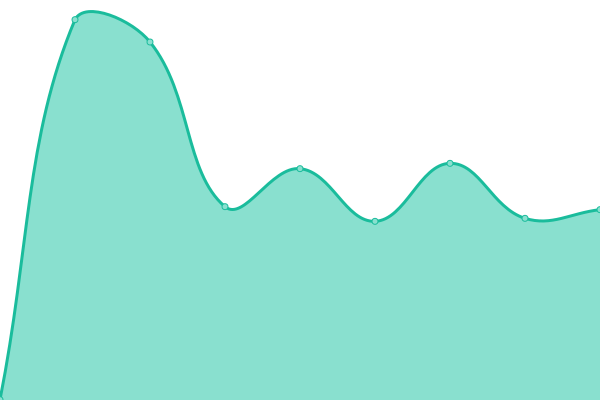
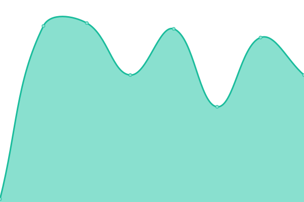

# [📈 Live Status](https://BYUCamachoLab.github.io/camacholab-upptime): <!--live status--> **🟩 All systems operational**

This repository contains the open-source uptime monitor and status page for [CamachoLab](https://camacholab.byu.edu/), powered by [Upptime](https://github.com/upptime/upptime).

With [Upptime](https://upptime.js.org), you can get your own unlimited and free uptime monitor and status page, powered entirely by a GitHub repository. We use [Issues](https://github.com/BYUCamachoLab/camacholab-upptime/issues) as incident reports, [Actions](https://github.com/BYUCamachoLab/camacholab-upptime/actions) as uptime monitors, and [Pages](https://BYUCamachoLab.github.io/camacholab-upptime) for the status page.

<!--start: status pages-->
<!-- This summary is generated by Upptime (https://github.com/upptime/upptime) -->
<!-- Do not edit this manually, your changes will be overwritten -->
<!-- prettier-ignore -->
| URL | Status | History | Response Time | Uptime |
| --- | ------ | ------- | ------------- | ------ |
|  [CamachoLab Wiki](https://camacholab.ee.byu.edu) | 🟩 Up | [camacho-lab-wiki.yml](https://github.com/BYUCamachoLab/camacholab-upptime/commits/HEAD/history/camacho-lab-wiki.yml) | 

 873ms
     
 | 

<a href="https://BYUCamachoLab.github.io/camacholab-upptime/history/camacho-lab-wiki">100.00%</a>
    

|  [QRNG Server](https://camacholab.ee.byu.edu/qrng) | 🟩 Up | [qrng-server.yml](https://github.com/BYUCamachoLab/camacholab-upptime/commits/HEAD/history/qrng-server.yml) | 

 76ms
     
 | 

<a href="https://BYUCamachoLab.github.io/camacholab-upptime/history/qrng-server">100.00%</a>
    

|  [QRNG Hardware](https://camacholab.ee.byu.edu/qrng/binary/10) | 🟩 Up | [qrng-hardware.yml](https://github.com/BYUCamachoLab/camacholab-upptime/commits/HEAD/history/qrng-hardware.yml) | 

 77ms
     
 | 

<a href="https://BYUCamachoLab.github.io/camacholab-upptime/history/qrng-hardware">100.00%</a>
    

<!--end: status pages-->

[**Visit our status website →**](https://BYUCamachoLab.github.io/camacholab-upptime)

## 📄 License

- Powered by: [Upptime](https://github.com/upptime/upptime)
- Code: [MIT](./LICENSE) © [Anand Chowdhary](https://anandchowdhary.com), supported by [Pabio](https://pabio.com)
- Data in the `./history` directory: [Open Database License](https://opendatacommons.org/licenses/odbl/1-0/)
